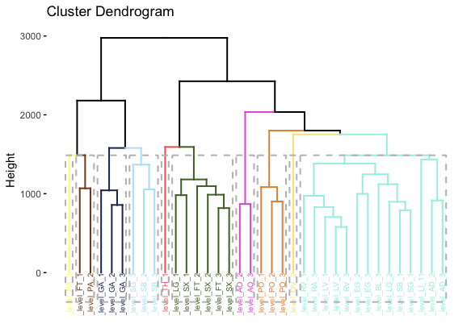
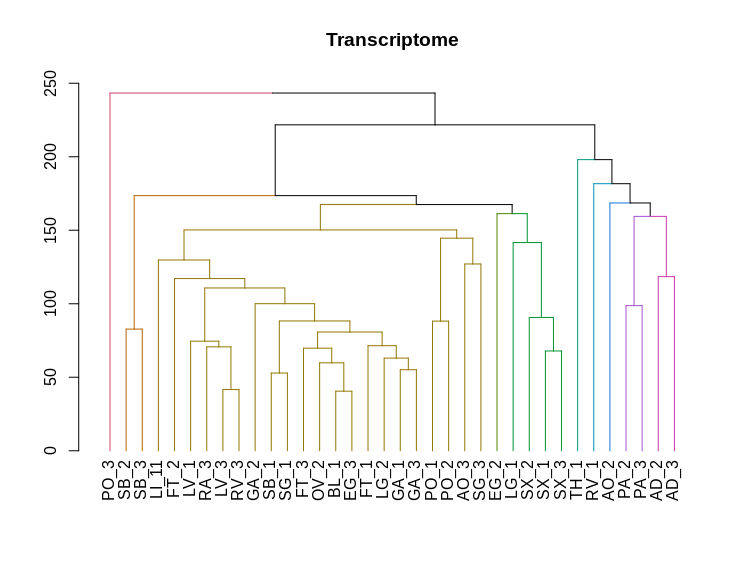
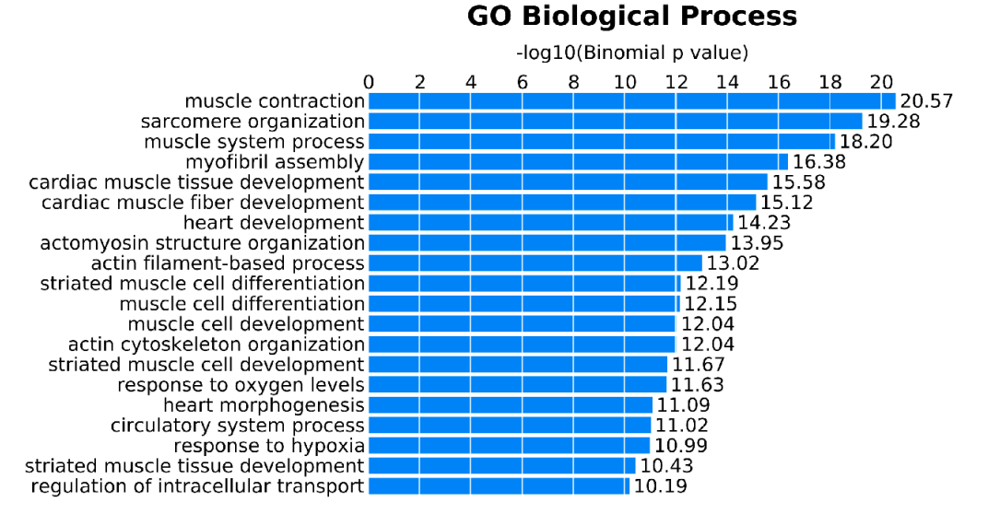
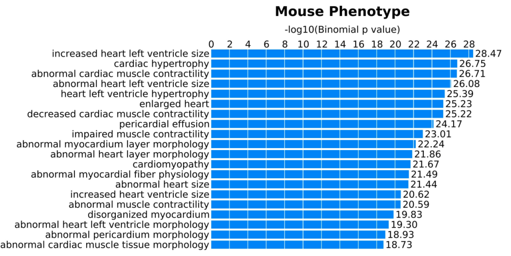

# May_2019_Epigenome Map

## Contributors

Kerry Goetz - kerry.goetz@nih.gov

Gabriel Goodney

Regina Umarova - regina.umarova@nih.gov

Dongjing Wu

Guanghui Yang

## Article for Reproduction
"Human body epigenome maps reveal noncanonical DNA methylation variation," Nature. https://doi.org/10.1038/nature14465

## Approach

This was a very complex paper with a lot of different methods and outputs. The first step was to review the supplemental material and outline the methods for each section. [Check out the outline here:](/outline.pdf)

Our group chose to focus on reproducing a few figures from the manuscript.

**CG DMR Dendrogram**

Description from supplement: "To create the dendrogram shown in **Fig. 1c**, we first used the cmdscale command from R to perform multidimensional scaling and compute the first 15 principal components of the CG DMR methylation level matrix. The percent variance explained from this multidimensional scaling is  presented in Extended Data Fig. 1c. Next, we used the heatmap.2 function in the R package gplots18 with the default distance metric, and  the Ward hierarchical clustering method on these principal components to generate the dendrogram." 

#### Here is the Fig 1c reproduced image using a different workflow

**Differentially Expressed Genes Dendrogram**

Description from supplement: "To create the dendrogram shown in Fig. 1d, we first used the cmdscale command from R to 
perform multidimensional scaling and compute the first 15 principal components of the RPKM 
values, which were first normalized by the maximum expression value observed at each locus, 
from all differentially expressed genes. The percent variance explained from this 
multidimensional scaling is presented in Extended Data Fig. 1d. Next, we used the heatmap.2 
function in the R package gplots18 with the default distance metric, and the Ward hierarchical 
clustering method on these principal components to generate the dendrogram." 

#### Here is the Fig 1f reproduced image as close as we could get

**DMR GO Enrichment** 

Description from supplement: "We used GREAT23 with default parameters to find functional terms of genes near CG DMRs as 
these terms indicate the potential regulatory functions of these CG DMRs. Since too many 
DMRs can saturate the Hypergeometric Test it uses, we considered at most the top 5,000 
DMRs sample-specific DMRs ranked (largest to smallest) by the difference (which has to be 
greater or equal to 0.1) in methylation level between the hypermethylated and hypomethylated 
groups as input. Furthermore, we require each of these DMRs to have at least 4 DMSs. We 
focused on the GO Biological Process and Mouse Phenotype categories and representative 
results from this analysis are shown in Extended Data Fig 1e and f. The complete results are in 
Supplementary Tables 2 and 3." 

Original Extended Figure 1 e and f 

#### Reproduced figures May_2019_Epigenome/figures/ExtFig1d.png 
 
 

