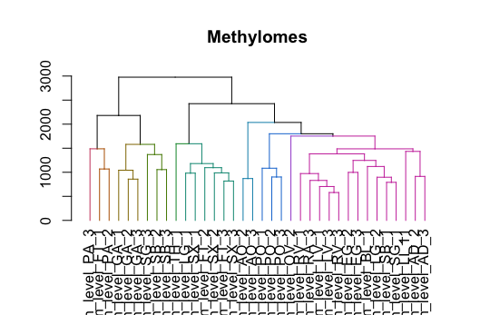

# May_2019_Epigenome Map

## Contributors

Kerry Goetz - kerry.goetz@nih.gov

Gabriel Goodney

Regina Umarova - regina.umarova@nih.gov

Dongjing Wu

Guanghui Yang

## Article for Reproduction
"Human body epigenome maps reveal noncanonical DNA methylation variation," Nature. https://doi.org/10.1038/nature14465

## Approach

This was a very complex paper with a lot of different methods and outputs. The first step was to review the supplemental material and outline the methods for each section. [Check out the outline here:](/outline.pdf)

Our group chose to focus on reproducing just one part of this article described as:

**CG DMR Dendrogram**

Description from supplement: "To create the dendrogram shown in **Fig. 1c**, we first used the cmdscale command from R to perform multidimensional scaling and compute the first 15 principal components of the CG DMR methylation level matrix. The percent variance explained from this multidimensional scaling is  presented in Extended Data Fig. 1c. Next, we used the heatmap.2 function in the R package gplots18 with the default distance metric, and  the Ward hierarchical clustering method on these principal components to generate the dendrogram." 

**Differentially Expressed Genes Dendrogram**

Description from supplement: "To create the dendrogram shown in Fig. 1d, we first used the cmdscale command from R to 
perform multidimensional scaling and compute the first 15 principal components of the RPKM 
values, which were first normalized by the maximum expression value observed at each locus, 
from all differentially expressed genes. The percent variance explained from this 
multidimensional scaling is presented in Extended Data Fig. 1d. Next, we used the heatmap.2 
function in the R package gplots18 with the default distance metric, and the Ward hierarchical 
clustering method on these principal components to generate the dendrogram." 
